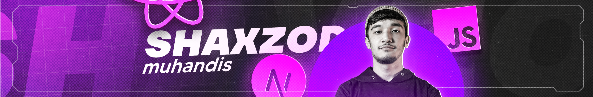

<h1 align="center">Assalomu Alaykum there 👋</h1>

###

### 👩‍💻 About Me

###

#### My name is Shaxzod and I'm a Frontend Engineer, from  **Uzbekistan, Karshi**

##### - 🔭 I work as a Frontend Engineer at Open Web.

##### - 📚 I am currently deep learning JavaScript and TypeScript and Algorithms.

##### - ⚡ In my spare time I read books, write blogs and sometimes play CS2.

##### - 🎯 My future goal is to become one of the best professionals in my field and to teach my field to others.

###

### 🛠 Language and tools

###

  
  
  
  
  
  
  
  
  
  
  
  
  
  
  
  
  
  
  
  
  
  
  

#

### My social media pages:

### If you want to bring coffee:

